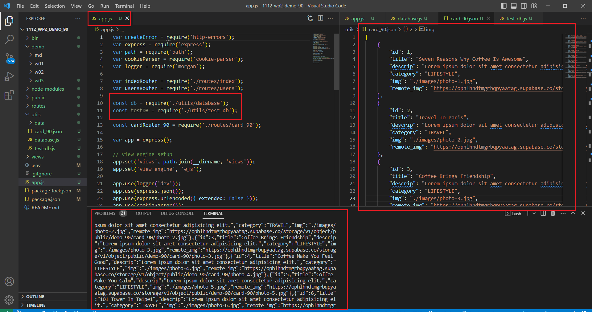
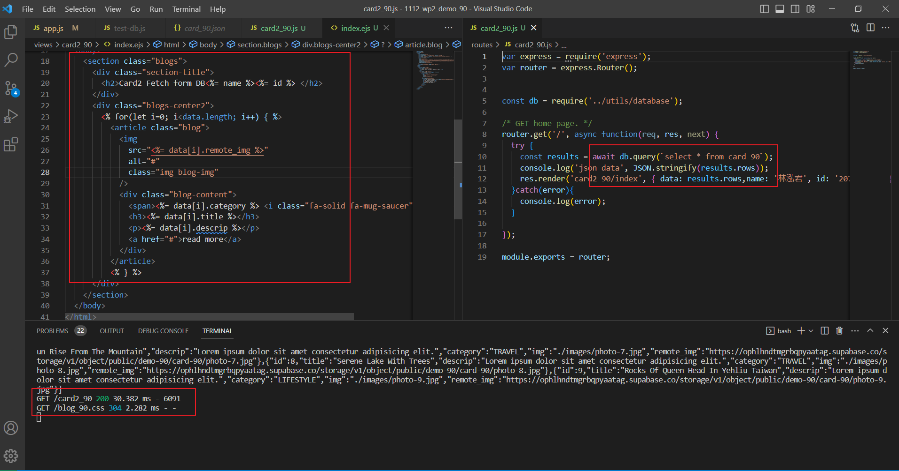
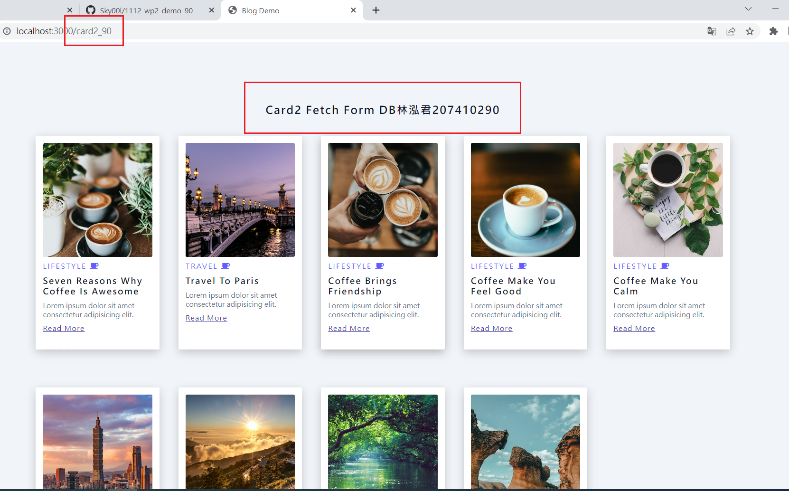

### W03-P1: testDB to get 9 data from card_xx tables 

### W03-P2: fetch 9 data from card_xx table and placed in card2_xx/index.ejs 

### w03-p4: git log

git log --pretty=format:"%h%x09%an%x09%ad%x09%s" --after="2023-2-28"
