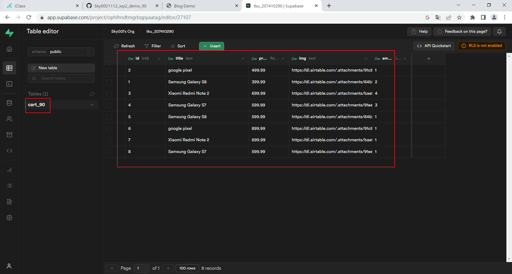

### W03-P1: testDB to get 9 data from card_xx tables 


### W03-P2: fetch 9 data from card_xx table and placed in card2_xx/index.ejs 


### w03-p3: supabase and pgadmin img




### w03-p4: git log


git log --pretty=format:"%h%x09%an%x09%ad%x09%s" --after="2023-2-28"

```$ git log --pretty=format:"%h%x09%an%x09%ad%x09%s" --after="2023-2-28"
a3eb67e Sky00l  Wed Mar 1 21:28:40 2023 +0800   w03-p3: supabase and pgadmin img
2c6133e Sky00l  Wed Mar 1 20:24:11 2023 +0800   W03-P2: fetch 9 data from card_xx table and placed in card2_xx/index.ejs
a5f9300 Sky00l  Wed Mar 1 19:25:07 2023 +0800   W03-P1: testDB to get 9 data from card_xx tables
```
